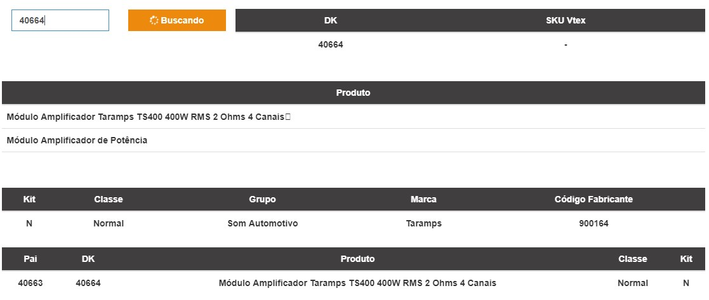
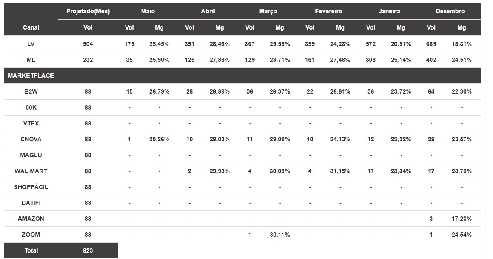
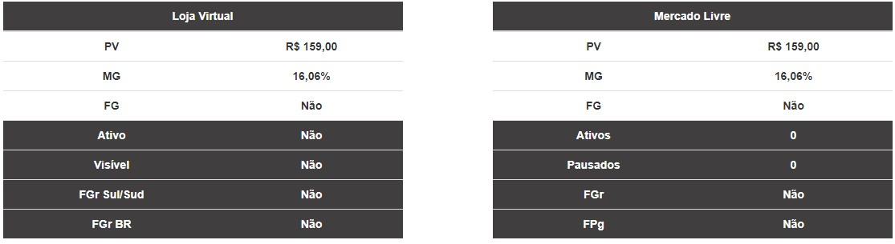
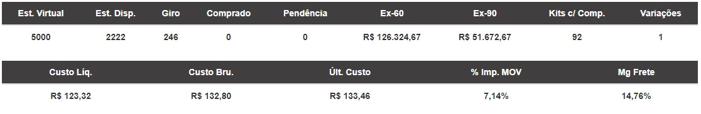

# Calculadora

## Funcionalidade

Trazer os principais dados do produto como Canais, Estoque, Venda dos últimos 6 meses e dados cadastrais.

## Calculadora Parte 1

## Processo

A pesquisa será por DK, pode ser Dk Pai, Dk Filho ou Kit. Após a pesquisa ser realizada na aba 'SKU Vtex' irá mostrar o sku da vtex se houver. Na Aba 'Produto' mostrará a descrição do produto e logo abaixo a abreviatura do mesmo. E nas demais abas dessas primeira parte da calculadora será apresentado as demais informações. As informações da primeira imagem são retirada diretamente do Ábacos.

As informações que serão mostradas na tabela de 'Canal' são retiradas em tempo real do Banco de Dados e Datawarehouse. O valor do atributo Vol\(Volume\) é a soma de quantidade de notas faturadas no mês indicado. O valor do atributo Mg\(Margem\) é o preço de venda menos o preço de custo em porcentagem. No atributo Projetado\(Mês\) é a soma do total de vendas de cada mês divido por 5\(Cinco\), sem contar o mês atual. Nos Marketplace serão mostrados os atributos já citados.

## Calculadora Parte 2

## Processo

As informações da Loja Virtual são adquiridas do bando de dados do Ábacos e da API da VTEX. A margem é calculada da seguinte forma: preço de venda menos o preço de custo em porcentagem. Todas as informações são consultadas em tempo real.

As informações do Mercado Livre são adquiridas do banco de dados do Ábacos e do banco de dados dos Anúncios da Connect Parts no Mercado Livre. A margem é calculada da seguinte forma: preço de venda menos o preço de custo em porcentagem. Todas as informações são consultadas em tempo real.

## Calculadora Parte 3

## Processo

A informação da aba 'Estoque Virtual' é recuperada do saldo de produtos informado no Ábacos com status 4.

A informação da aba 'Estoque Disponível' é recuperada do saldo de produtos informado no Ábacos com status 8.

A informação da aba 'Giro' é recuperada dos pedidos informados no Ábacos, onde são a somatória das quantidades solicitadas por cada produto, com status comercial 1, e no período do mês atual.

A informação da aba 'Pendência Compra' é recuperada dos pedidos informados do Ábacos, onde são a soma da quantidade dos itens dos pedidos que estão com status comercial de aguardando a compra.

A informação da aba 'Pendência Venda' é recuperada dos pedidos informados no Ábacos, onde são a soma da quantidade dos itens dos pedidos que estão com status comercial de pendente de compra \(Status 8 e 9\).

As informações da aba 'Ex-\(exorbitante\)' são recuperadas do banco de dados do Ábacos. Consiste na seguinte formula: \(\(quantidade de saldo disponível - \(giro período\)\)Custo liquido do produto\) = exorbitante.

A informação da aba 'Kits com Componentes' é recuperada do banco de dados do Ábacos, onde consiste na soma de todos os kits onde o produto faz parte.

A informação da aba 'Variações' é recuperada do banco de dados do Ábacos, onde consiste na soma de produtos onde faz relação com o mesmo DK informado. Onde faz relação com o mesmo DK informado.

A informação de Custo Liquido é recuperada da base de dados do Ábacos.

A informação de Custo Bruto é recuperada da base de dados do Ábacos.

A informação de Último Custo é recuperada da base de dados do Ábacos, onde o valor bruto é o último utilizado.

A informação de Imposto é recuperada da base de dados do Ábacos, onde o valor do imposto é o valor bruto menos o valor do custo liquido em porcentagem.

A informação de Margem é recuperada da base de dados do Ábacos, onde o valor consiste no valor do preço de venda do item menos o valor do frete em porcentagem.

## Calculadora Parte 4

## Processo

Na parte superior da tela inicial da calculadora existe um campo de seleção\(Select\) onde o usuário poderá selecionar para qual tela ele poderá ir.

### Comparativo de Preços entre Canais: LV\(Loja Virtual\) X ML\(Mercado Livre\)

#### Tipos de Filtros

O usuário poderá selecionar entre buscar os produtos através de filtros ou através de Dk.

####  Filtro

Nos campos 'Categoria', 'Classe' e 'Forma de Comparação' são listados automaticamente. Para habilitar o campo 'Grupo' é preciso selecionar algum atributo do campo 'Categoria' para especificar em qual categoria ele irá trazer atributos de grupos. Para habilitar o campo 'Subgrupos' e 'Marca' é preciso selecionar algum atributo do campo 'Grupo' para especificar em qual categoria ele irá trazer atributos de subgrupos e marca.

#### Dk

Nesse tela o usuário poderá inserir um dk especifico e buscá-lo.

#### Listagem

O modelo de informações apresentada esta na imagem acima.

### Margem Estimada Produtos

#### Tipos de Filtros

  
O usuário poderá selecionar entre buscar os produtos através de filtros ou através de Dk.

#### Filtro

  
Nos campos 'Categoria' e 'Classe' são listados automaticamente. Para habilitar o campo 'Grupo' é preciso selecionar algum atributo do campo 'Categoria' para especificar em qual categoria ele irá trazer atributos de grupos, no campo 'Categoria' não existe a opção 'Todos' pois são muitas informações buscadas e isso irá demandar muito de processamento e uma demora muito grande. Para habilitar o campo 'Subgrupos' e 'Marca' é preciso selecionar algum atributo do campo 'Grupo' para especificar em qual categoria ele irá trazer atributos de subgrupos e marca. o Botão de buscar só ira ser habilitado depois do usuário selecionar alguma opção do campo 'Grupo'.

#### DK

Nesse tela o usuário poderá inserir um dk especifico e buscá-lo.

#### Listagem

O modelo de informações apresentada esta na imagem acima. Para mais detalhes sobre o produto existe um botão 'Informações' onde ao clicá-lo irá abrir um modal com maiores informações.

###  **Classe de Kit X Classe Componentes**

#### Filtro

  
Nos campos 'Categoria', 'Classe de Kit' e 'Classe Componentes' são listados automaticamente. Para habilitar o campo 'Grupo' é preciso selecionar algum atributo do campo 'Categoria' para especificar em qual categoria ele irá trazer atributos de grupos, no campo 'Categoria' não existe a opção 'Todos' pois são muitas informações buscadas e isso irá demandar muito de processamento e uma demora muito grande. Para habilitar o campo 'Subgrupos' é preciso selecionar algum atributo do campo 'Grupo' para especificar em qual categoria ele irá trazer atributos de subgrupos e marca. o Botão de buscar só ira ser habilitado depois do usuário selecionar alguma opção do campo 'Grupo'.

#### Listagem

O modelo de informações apresentada esta na imagem acima. Para mais detalhes sobre o componentes do produto existe um botão 'Componentes' onde ao clicá-lo irá abrir um modal com maiores informações.

###  **Kits de Um Componente**

#### Filtro

Nos campos 'Categoria' e 'Classe' são listados automaticamente. Para habilitar o campo 'Grupo' é preciso selecionar algum atributo do campo 'Categoria' para especificar em qual categoria ele irá trazer atributos de grupos, no campo 'Categoria' não existe a opção 'Todos' pois são muitas informações buscadas e isso irá demandar muito de processamento e uma demora muito grande. Para habilitar o campo 'Subgrupos' e 'Marca' é preciso selecionar algum atributo do campo 'Grupo' para especificar em qual categoria ele irá trazer atributos de subgrupos e marca. o Botão de buscar só ira ser habilitado depois do usuário selecionar alguma opção do campo 'Grupo'.

#### Listagem

  
O modelo de informações apresentada esta na imagem acima.

### **PV dos Kits X PV Componentes Individuais**

#### Filtro

Nos campos 'Categoria', 'Classe', 'Forma de Comparação' e 'Canais' são listados automaticamente. Para habilitar o campo 'Grupo' é preciso selecionar algum atributo do campo 'Categoria' para especificar em qual categoria ele irá trazer atributos de grupos, no campo 'Categoria' não existe a opção 'Todos' pois são muitas informações buscadas e isso irá demandar muito de processamento e uma demora muito grande. Para habilitar o campo 'Subgrupos' é preciso selecionar algum atributo do campo 'Grupo' para especificar em qual categoria ele irá trazer atributos de subgrupos e marca. o Botão de buscar só ira ser habilitado depois do usuário selecionar alguma opção do campo 'Grupo'. É preciso selecionar um das opções no campo 'Canais'.

#### Listagem

  
O modelo de informações apresentada esta na imagem acima. Para mais detalhes sobre o produto existe um botão 'Detalhes' onde ao clicá-lo irá abrir um modal com maiores informações.

