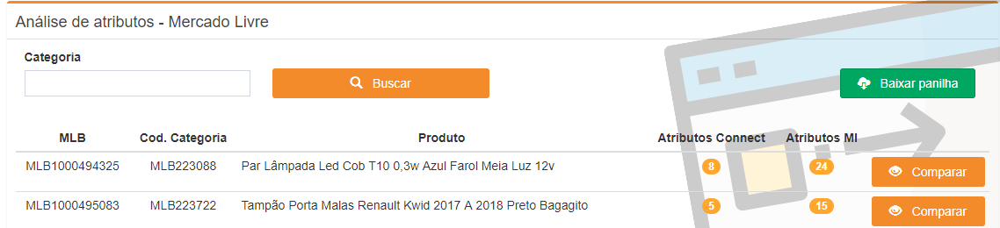

# Análise de Atributos

## Funcionalidade

Comparar atributos de anúncios do Mercado Livre cadastrados com atributos disponíveis.

## Regras

Uma Cron\(Serviços\) que coleta as informações dos atributos dos anúncios na madrugada, ou seja ele irá pegar anúncios do dia anterior\(D - 1\).

## Processo

A campo 'Categoria' irá buscar os anúncios com base no 'Código Categoria'. Ao clicar no botão 'Baixar Planilha' irá baixar\(Download\) de um arquivo .xlsx que irá trazer as informações do mesmo.

Obs: Liberar o download dos arquivos no navegador.

No botão 'Comparar' irá abrir uma subtela\(Modal\) com as seguintes informações que vem também da Cron\(Serviço\).

