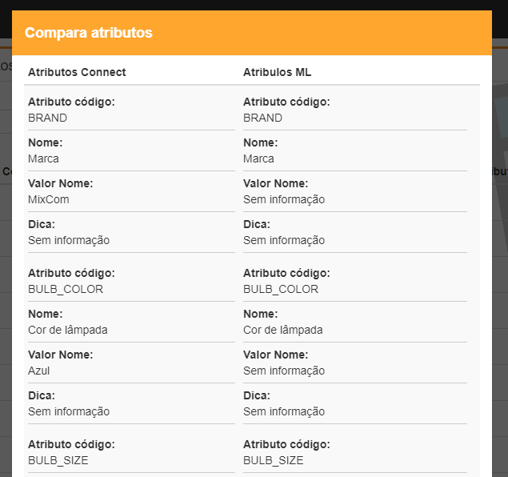

# Análise de Atributos

## Funcionalidade

Com base nos anúncios Connect, é realiza uma busca no mercado livre, através de cron \(que roda uma vez por semana\) trazendo todos os atributos disponíveis para uso e, diariamente, através de cron, busca todos os atributos cadastrados pela Connect.

A principal função da ferramentar, é fazer uma comparação entre os valores disponível e cadastrados, permitindo assim, uma ação de adequação e complementação do cadastro no mercado livre.É possível, caso necessário, ignorar atributos, para que não seja feita analise.

## Regras

Uma Cron\(Serviços\) que coleta as informações dos atributos dos anúncios na madrugada, ou seja ele irá pegar anúncios do dia anterior\(D - 1\). São considerados atributos com relevância 1 ou nullo, sempre trazendo SKU. Não são considerados atributos com 'tag hiden'\(tag escondida\). 

## Processo

A campo 'Pesquisar' irá buscar os anúncios com base no 'Código Categoria'. E a caixa de seleção se o anúncio esta ignorado ou não.

Obs: Liberar o download dos arquivos no navegador.

No botão 'Comparar' irá abrir uma subtela\(Modal\) com as seguintes informações que vem também da Cron\(Serviço\). Ao clicar no botão 'Ignorar anúncio' ele ira ignorar o anúncio.

Documento de Apoio: [http://developers.mercadolibre.com/pt-br/identificadores-de-produtos/](http://developers.mercadolibre.com/pt-br/identificadores-de-produtos/)

