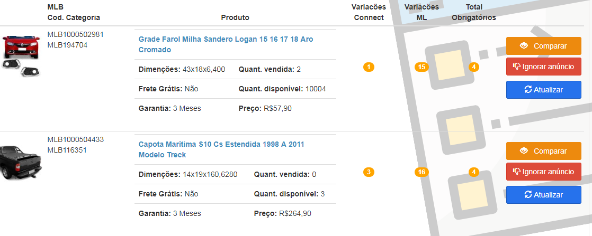

# Analise Variações Mercado Livre

## Funcionalidade

Com base nos anúncios Connect, é realiza uma busca no mercado livre, através de cron \(que roda uma vez por semana\) trazendo todos os variação disponíveis para uso e, diariamente, através de cron, busca todos os variação cadastrados pela Connect.

A principal função da ferramentar, é fazer uma comparação entre os valores disponível e cadastrados, permitindo assim, uma ação de adequação e complementação do cadastro no mercado livre.É possível, caso necessário, ignorar variação , para que não seja feita analise.

## Processo

**Pesquisa**

* **Pesquisar:** Por este campo poderá ser pesquisado **Código externo pai**, **Código categoria** e **MLB**.
* **Listar Ignorados:** Nesta opção iremos listar todos os anúncios que foram ignorados.

**Resultado**

* **Informações sobre o produto** e pelo **título** link para acesso deste produto no Mercado Livre.
* **Ignorar anúncio:** Há a possiblidade de ignorar o anúncio e também a possibilidade de listar os ignorados no filtro **Listar Ignorados**.

**Ver atributos**

* **Ver atributos:** Apresentamos a hierarquia mais importante que o Mercado livre nos oferece para preenchimento de variações.

## Regras

* Há um serviço que coleta estas informações todas as madrugadas.
* O serviço consulta no Mercado Livre e verifica todas as categorias que possa ter variação e cruza com as nossas categorias, trazendo o que não possuímos de variação.
* Podemos ignorar os anúncios que estão sem variações

## Observação

* Liberar a os Pop-ups do navegador para que seja feita a **Exportação Excel Listados**

## Responsabilidades

* **Comercial:**
  * Fazer a análise.
* **Desenvolvimento:**
  * Manutenção do sistema de coleta de informações e exposição destas informações.

