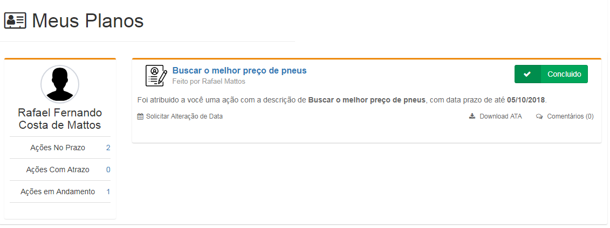
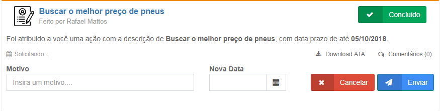
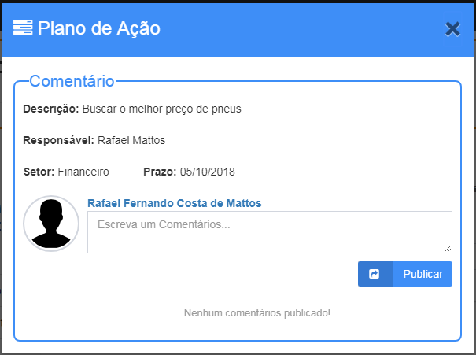

# Meus Planos

## Funcionalidade

Meus Planos tem a finalidade de auxiliar os colaboradores a organizar as ações atribuídas e ele.

## Processos

A tela apresenta uma lista de ações atribuídas ao usuário, onde ele poderá:

* Concluir a ação: O usuário poderá concluir a ação ao clicar no botão "Concluído" . Obs..: O usuário não poderá concluir uma ação com sub-ações pendentes.
* Solicitar Alteração de Data: O usuário poderá solicitar uma alteração de data da ação ao clicar em "Solicitar Alteração de Data" e ira abrir uma box embaixo a respectiva ação. 

* Download ATA: O usuário poderá fazer o download da ATA no formato .doc daquela ação.
* Comentários: O usuário poderá enviar mensagens para discutir sobre a ação. 

Ao lado esquerdo da tela ira ter informações que quantas ação você concluiu no prazo, com atraso ou em andamento.

