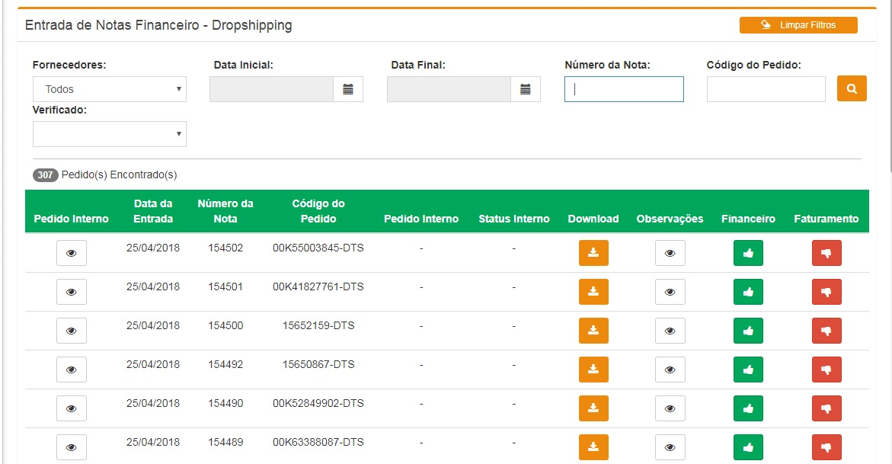

# Nova entrada de notas

## Funcionalidade

## Processo

Este processo se assemelha ao anterior **Entrada de notas** porém com menos intervenção humana. As notas de entradas estarão dispostas para Connect ao mesmo tempo que as notas do cliente, certificando de que estão dando a entrada na NF correta para o pedido correto, auditando os lançamentos das notas **DropShipping**.

Há filtros de **Fornecedores** que apresenta todos os clientes **dropshipping**, **datas**, **Número das notas**, **Código do Pedido**, **Verificado** \(_Todos,Aguardando ação do financeiro, Aguardando ação do faturamento e Concluídos_\).

## Resultado

Em **Downloads** temos a Nota Fiscal em formato **.pdf**, **Observalções** que foram feitas, aprovações ou reprovações dos departamentos **Finaceiro** e **Faturamento** e o código do **Pedido interno**.

## Regras

