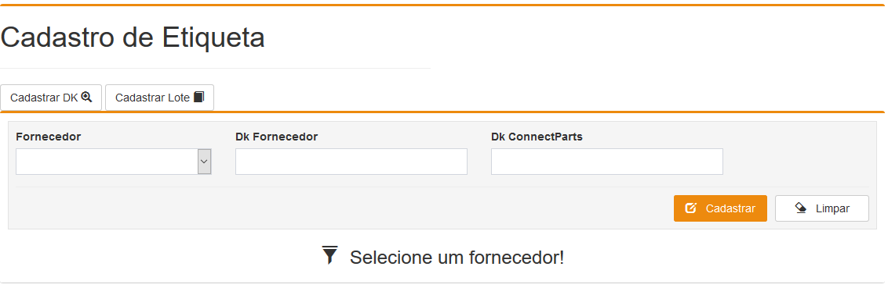
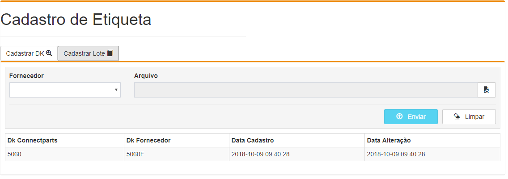
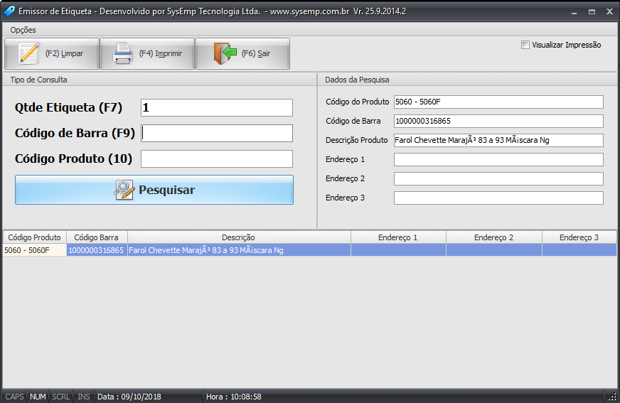

# Etiqueta

## Funcionalidade 

Cadastro de relação de Dk por vez, ou em lote.

### Processos


  
Permite o cadastramento de uma relação de DK por vez. 

A tela contém os campos “Fornecedor”, “Dk Fornecedor” e “Dk ConnectParts”, aonde é obrigatório a escolha do fornecedor e informar o DK do fornecedor e o DK da ConnectParts, para realizar o cadastro.

Ao clicar no botão “Cadastrar” a tela irá relacionar a peça do fornecedor com a peças da ConnectParts.

Ao finalizar o cadastro com sucesso, a tela irá informar em uma lista, todas as relações de produtos que o fornecedor possui com a ConnectParts.

Permite o cadastramento em lote via arquivo .CSV relacionando os DKs do fornecedor com os DKs da ConnectParts.

A tela contém os campos “Fornecedor” e o campo “Arquivo” de upload do arquivo, aonde o sistema irá ler o arquivo e realizar o relacionamento dos produtos ConnectParts com os produtos do Fornecedor.


  
Layout do arquivo

O arquivo tem que ser um “.csv” e conter as informações separadas por “;”, o primeiro campo é o DK da ConnectParts e o segundo campo é o DK do fornecedor.

Ex:

5060; 5060F

5010; XPTO10F

Ao clicar no botão “Cadastrar” o sistema irá ler o arquivo e relacionar as peças do fornecedor com as peças da ConnectParts.

Ao finalizar o cadastro com sucesso, a tela irá informar em uma lista, todas as relações de produtos que o fornecedor possui com a ConnectParts.

Resultado

Após a finalização do cadastro o sistema de impressão de etiquetas irá imprimir o DK da ConnectParts e o DK do Fornecedor, no campo Código Produto e na etiqueta impressa.

