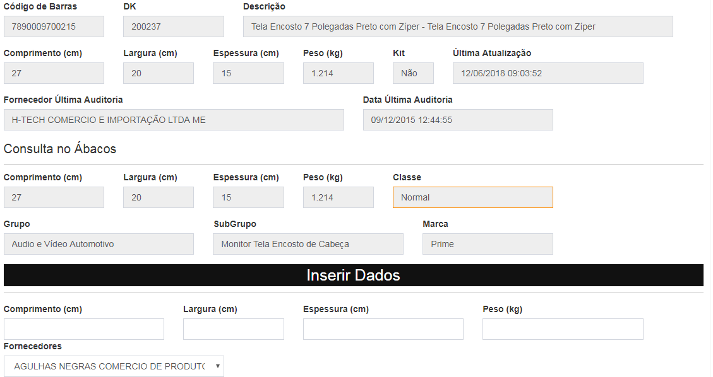

# Auditar Produto

## Funcionalidade 

A tela de auditoria de produto serve para conferência e cadastro de dimensões e peso do produto.

A tela é dividida em 3 abas, sendo:

## **Consultar DK** 

Nessa tela existe um campo para consultar as informações do Dk, e também dando a possibilidade de inserir novos atributos do produto.

## **Relatório Auditar** 

Nessa tela é exibido a listagem de todos os Dk's que estão para serem verificados. Após a verificação dos atributos do produto, existe um botão "Corrigido" que ao clicar ele altera o status para corrigido.

### Regra de Acesso

Somente o pessoal do Cadastro poderá visualizar e clicar no botão "Corrigido".

## **Pesquisar** 

Nessa tela existe um filtro de Data Inicial e Data Final, onde é possível visualizar um relatório do período selecionado, com a opção de exportar para Excel\(.csv\).

